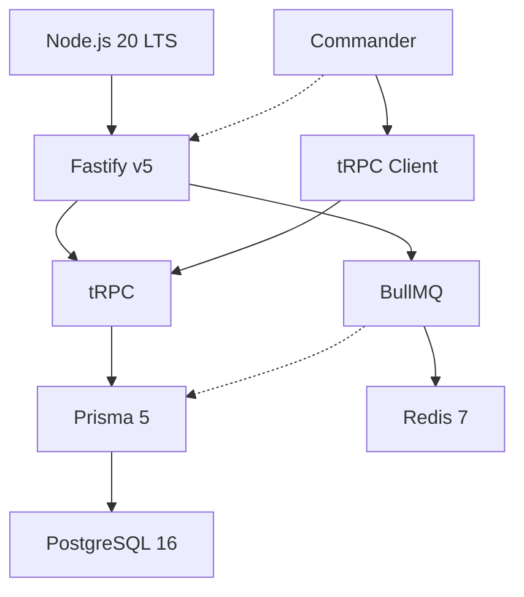
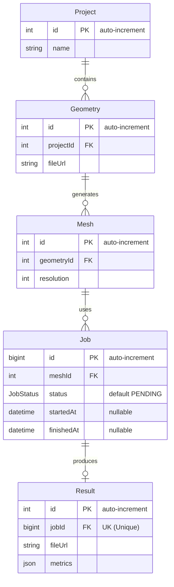

# Simulation-as-a-Service
backend practice

## 설계

```mermaid
  flowchart TD
    Runtime["Node.js 20 LTS"] --> WebFramework["Fastify v5"]
    WebFramework --> TRPC["tRPC"]
    TRPC --> ORM["Prisma 5"]
    ORM --> DB["PostgreSQL 16"]
    
    CLI["Commander"] --> TRPC_Client["tRPC Client"]
    TRPC_Client --> TRPC
    
    WebFramework --> BullMQ["BullMQ"]
    BullMQ --> Redis["Redis 7"]
    
    CLI -.-> WebFramework
    BullMQ -.-> ORM
```

## 스키마

```mermaid
  erDiagram
    Project {
        int id PK "auto-increment"
        string name
    }

    Geometry {
        int id PK "auto-increment"
        int projectId FK
        string fileUrl
    }

    Mesh {
        int id PK "auto-increment"
        int geometryId FK
        int resolution
    }

    Job {
        bigint id PK "auto-increment"
        int meshId FK
        JobStatus status "default PENDING"
        datetime startedAt "nullable"
        datetime finishedAt "nullable"
    }

    Result {
        int id PK "auto-increment"
        bigint jobId FK "UK (Unique)"
        string fileUrl
        json metrics
    }

    %% --- Relationships ---
    Project ||--o{ Geometry : "contains"
    Geometry ||--o{ Mesh : "generates"
    Mesh ||--o{ Job : "uses"
    Job ||--o| Result : "produces"
    %% Job can have 0 or 1 Result; Result must have 1 Job

    %% --- Enum Definitions (as comments, as Mermaid ERD doesn't directly render Enums within diagram) ---
    %% enum JobStatus {
    %%  PENDING
    %%  RUNNING
    %%  FAILED
    %%  SUCCESS
    %% }
```
