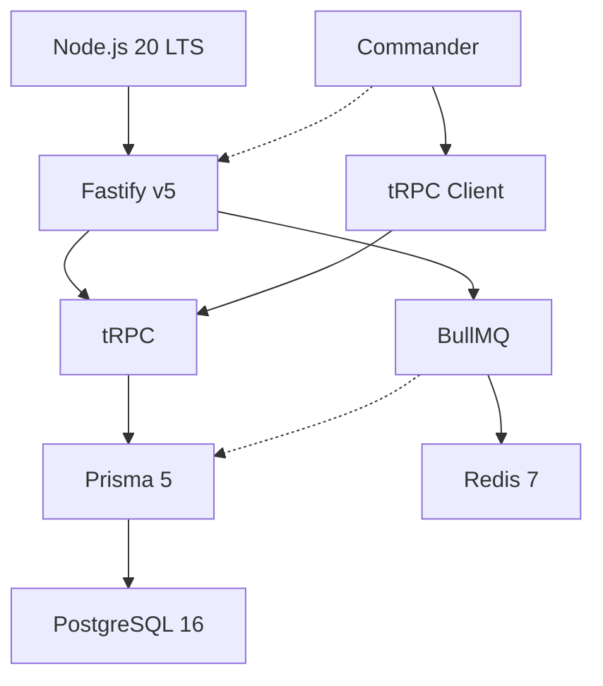
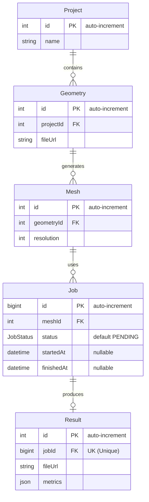

# CAE software backend workflow

## 설계



## 데이터베이스 설계



## 사용법

```sh
pnpm link --global ./cli
```

이제 터미널에서 `simsaas-cli` 명령어를 사용할 수 있습니다.

아래는 각 명령어와 옵션, 사용 예시를 정리한 가이드입니다.

### 프로젝트 관리

| 명령어                                  | 설명                            | 옵션/인자                     |
| --------------------------------------- | ------------------------------- | ----------------------------- |
| `project create <name>`<br>`p c <name>` | 새 프로젝트를 생성합니다        | `<name>`: 프로젝트 이름(필수) |
| `project list`<br>`p ls`                | 모든 프로젝트 목록을 조회합니다 | -                             |

**예시**

```sh
simsaas-cli project create '테스트 프로젝트'
simsaas-cli p ls
```

---

### 지오메트리 관리

| 명령어                                                                                 | 설명                                         | 옵션/인자                                                         |
| -------------------------------------------------------------------------------------- | -------------------------------------------- | ----------------------------------------------------------------- |
| `geometry create -p <project_id> -u <file_url>`<br>`g c -p <project_id> -u <file_url>` | 특정 프로젝트에 지오메트리를 추가합니다      | `-p, --project`: 프로젝트 ID(필수)<br>`-u, --url`: 파일 URL(필수) |
| `geometry list -p <project_id>`<br>`g ls -p <project_id>`                              | 특정 프로젝트의 지오메트리 목록을 조회합니다 | `-p, --project`: 프로젝트 ID(필수)                                |
| `geometry view <geometry_id>`<br>`g v <geometry_id>`                                   | 특정 지오메트리 상세 정보를 조회합니다       | `<geometry_id>`: 지오메트리 ID(필수)                              |
| `geometry delete <geometry_id>`<br>`g del <geometry_id>`                               | 특정 지오메트리를 삭제합니다                 | `<geometry_id>`: 지오메트리 ID(필수)                              |

**예시**

```sh
simsaas-cli geometry create -p 1 -u 'https://example.com/file.stl'
simsaas-cli g ls -p 1
simsaas-cli g v 2
simsaas-cli g del 2
```

---

### 메쉬 관리

| 명령어                                                                                     | 설명                                     | 옵션/인자                                                                 |
| ------------------------------------------------------------------------------------------ | ---------------------------------------- | ------------------------------------------------------------------------- |
| `mesh create -g <geometry_id> -r <resolution>`<br>`msh c -g <geometry_id> -r <resolution>` | 특정 지오메트리에 메쉬를 생성합니다      | `-g, --geometry`: 지오메트리 ID(필수)<br>`-r, --resolution`: 해상도(필수) |
| `mesh list -g <geometry_id>`<br>`msh ls -g <geometry_id>`                                  | 특정 지오메트리의 메쉬 목록을 조회합니다 | `-g, --geometry`: 지오메트리 ID(필수)                                     |
| `mesh view <mesh_id>`<br>`msh v <mesh_id>`                                                 | 특정 메쉬 상세 정보를 조회합니다         | `<mesh_id>`: 메쉬 ID(필수)                                                |
| `mesh delete <mesh_id>`<br>`msh del <mesh_id>`                                             | 특정 메쉬를 삭제합니다                   | `<mesh_id>`: 메쉬 ID(필수)                                                |

**예시**

```sh
simsaas-cli mesh create -g 2 -r 10
simsaas-cli msh ls -g 2
simsaas-cli msh v 3
simsaas-cli msh del 3
```

---

### 작업(Job) 관리

| 명령어                                           | 설명                               | 옵션/인자                   |
| ------------------------------------------------ | ---------------------------------- | --------------------------- |
| `job list`<br>`j ls`                             | 모든 작업 목록을 조회합니다        | -                           |
| `job status <job_id>`<br>`j s <job_id>`          | 특정 작업의 상태를 조회합니다      | `<job_id>`: 작업 ID(필수)   |
| `job submit -m <mesh_id>`<br>`j sm -m <mesh_id>` | 특정 메쉬에 대한 작업을 제출합니다 | `-m, --mesh`: 메쉬 ID(필수) |

**예시**

```sh
simsaas-cli job list
simsaas-cli j s 1
simsaas-cli j sm -m 3
```

---

> 각 명령어는 `--help` 옵션을 통해 상세 사용법을 확인할 수 있습니다.
