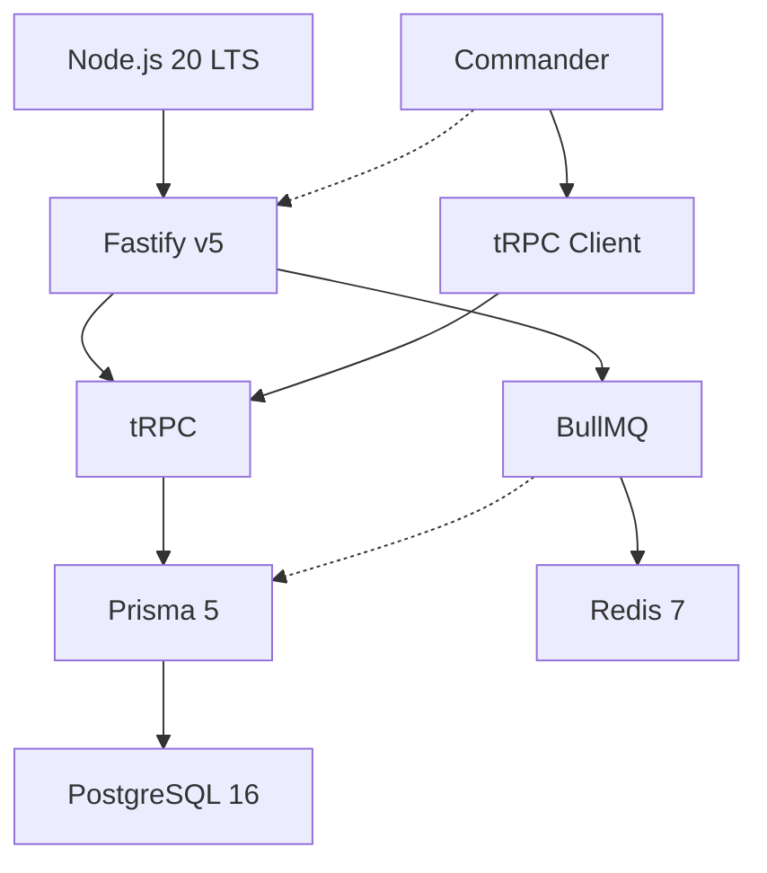

## 설계

```mermaid
  flowchart TD
    Runtime["Node.js 20 LTS"] --> WebFramework["Fastify v5"]
    WebFramework --> TRPC["tRPC"]
    TRPC --> ORM["Prisma 5"]
    ORM --> DB["PostgreSQL 16"]
    
    CLI["Commander"] --> TRPC_Client["tRPC Client"]
    TRPC_Client --> TRPC
    
    WebFramework --> BullMQ["BullMQ"]
    BullMQ --> Redis["Redis 7"]
    
    CLI -.-> WebFramework
    BullMQ -.-> ORM
```
